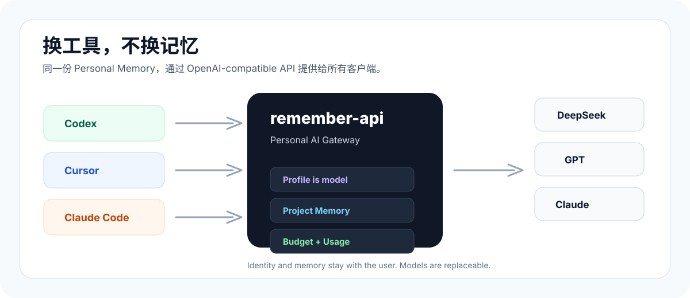
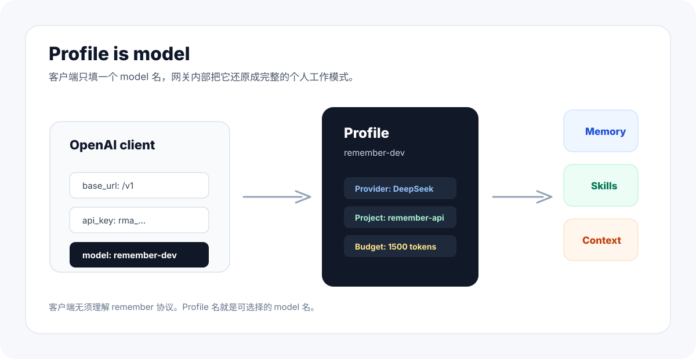

# remember-api

[English](README.md) | 简体中文

**创建一个属于你自己独立记忆的个人ai api。**

网站：<https://remember-api.cn>

remember-api 是一个自托管的 Personal AI API。它把你的身份、偏好、项目记忆、长期指令和模型路由放在一个 OpenAI-compatible `/v1` API 后面，让 Codex、Cursor、Cherry Studio、Open WebUI 等客户端连接到同一套个人状态。

模型可以换，你的 AI 不需要重来。



## 项目定位

**remember-api 是属于用户自己的 Personal AI Gateway。**

它的核心不是一个独立的 agent 应用，也不是重新造一个聊天应用模式，而是 **个人 AI（Personal AI）**：一个长期存在、理解你、跟随你、由你控制的 AI 身份。

remember-api 把你的身份、偏好、项目记忆和模型配置放在一个 OpenAI-compatible API 后面，让不同 AI 客户端都能连接到同一个属于你的个人 AI。工具只是入口，模型只是引擎，真正持续存在的是你的个人 AI。

## 核心价值

remember-api 最重要的价值不是“多一个 API 代理”，而是：**让你拥有自己的个人 AI，并让这个个人 AI 的数据不再被某个厂商绑定，让个人数据变成不可替代的资产沉淀下来。**

你的偏好、项目背景、历史决策、长期任务状态，本质上都是独属于你个人的长期资产。它们不应该天然属于某个聊天产品、某个 IDE 插件、某个模型供应商，也不应该只能在一家生态里生效。remember-api 把这些数据放回用户自己可控的 Personal AI 层里，让它们可以被查看、修正、删除、迁移，并按你的授权提供给不同工具使用。

这带来几个直接优势：

- **个人 AI 私有化**：你拥有的不是某个厂商账号里的临时助手，而是自己的个人 AI。
- **数据私人化**：个人偏好、项目记忆和长期上下文先属于你，再成为个人 AI 的能力。
- **不被厂商锁定**：今天用 DeepSeek，明天用 GPT，后天用 Claude，记忆不跟着厂商消失。
- **不被客户端锁定**：今天在 Codex 里工作，明天换 Cursor 或其他工具，项目上下文依然能延续。
- **不重复训练 AI**：你不必在每个新工具里重新解释“我是谁、我怎么工作、这个项目到哪了”。
- **可授权共享**：你可以把自己的核心资产，通过 API 授权给需要上下文的工具和工作流使用。

**只要某个工具或应用可以连接 OpenAI-compatible AI，理论上就可以连接 remember-api；只要它能连接 remember-api，就可以使用你授权的同一份个人 AI 记忆和项目上下文。**

这意味着 remember-api 不依赖某一个客户端成为入口。任何支持填写 Base URL、API Key、Model 的应用，都可以变成你个人 AI 的一个前端。你的个人 AI 才是中心，工具只是入口。

## 为什么需要它

现在的 AI 工具越来越多，但记忆通常被锁在某一个平台或客户端里：ChatGPT 记得一部分，Claude 记得一部分，IDE、Codex、本地工具又各自有一份上下文。

真正难迁移的不是模型 API，而是这些长期状态：

- 你是谁
- 你偏好什么
- 你正在做什么项目
- 之前做过哪些决定
- 哪些方案试过但失败了
- 一个长对话进行到了哪里

remember-api 的核心判断是：**Personal AI ≠ AI Model**。模型只是可替换的算力供应商；属于你的身份、记忆、偏好、项目状态和长期指令，应该由你自己拥有，并能在不同工具和模型之间复用。

## 它是什么

一句话：**换工具不换记忆，换模型不重新解释项目。**

remember-api 位于 AI 客户端和模型供应商之间：

```text
AI Client
  ↓  Base URL / API Key / Model
remember-api
  ↓  Profile / Project / Memory Budget
OpenAI-compatible Provider
```

它不是一个新的聊天 UI，而是一层长期个人状态 API：

- **OpenAI 兼容入口** —— 对外提供 `/v1/models` 与 `/v1/chat/completions`。
- **Personal AI 状态层** —— 把身份、偏好、项目记忆、长期指令和 Agent State 放进请求路径。
- **Profile-as-Model** —— 客户端里的 `model` 是 remember-api 的 Profile，不一定是厂商模型 id。Profile 决定 provider、上游模型、system prompt 和记忆预算。
- **API Key 隔离** —— 每把 API Key 只绑定一个 Profile，多个个人模型不会互相串用。
- **Project 级记忆边界** —— 长期偏好可复用，项目上下文有边界。
- **记忆成本可观察** —— Memory Budget 控制单次请求注入多少记忆，usage 记录 memory tokens、延迟和估算成本。
- **Provider 无关路由** —— 上游凭据和 provider 配置与客户端配置分离。
- **自托管优先** —— 你的记忆和配置保存在你自己的部署和数据库里。

## 核心概念

### Profile-as-Model

客户端里的 `model` 是 remember-api 的 **Profile** 名，不一定是厂商模型 id。

Profile 决定 provider、上游真实模型、system prompt / 长期指令、Project 上下文、Memory Budget，以及可用的记忆与能力。所以你可以保持客户端配置不变，只替换 Profile 底层的 provider 或真实模型。

### Project 级记忆边界

个人偏好可以长期复用，但项目上下文必须有边界。Project 用来隔离不同主题，避免把 A 项目的架构决策带进 B 项目。

适合沉淀的记忆包括：偏好、技术决策、进度状态、失败尝试、待办、长对话摘要和交接信息。

### Memory Budget

remember-api 不追求“无限塞进 prompt”。记忆会被检索、筛选、裁剪，再按预算注入请求。

Memory Budget 让记忆使用更可控，也让 usage 能记录 memory tokens、延迟和估算成本。

### 一个 API Key 只绑定一个 Profile

每把 API Key 只能访问它绑定的 Profile。这样客户端不会误请求其他个人 model，也减少不同身份和项目状态之间的串用。

### 记忆不只是聊天历史

remember-api 要沉淀的不是原始 transcript，而是可复用的长期个人状态：preferences、decisions、status、tasks、issues / failed attempts、recent-thread handoff、long-conversation summaries 和 recallable memory。

## 工作方式



一次请求进入 remember-api 后，大致会经历这些步骤：

1. 根据 API Key 找到绑定的个人 Profile。
2. 检查请求的 `model` 是否就是这个 key 允许访问的 Profile。
3. 读取 Profile 的 system prompt、底层 provider 和真实模型名。
4. 根据最后一条用户消息检索相关记忆，并按 Memory Budget 裁剪。
5. 把稳定偏好、会话交接摘要和记忆召回提示放入 system 前缀。
6. 把本轮相关记忆折叠进最后一条 user 消息，减少 prompt cache 抖动。
7. 调用底层模型，返回 OpenAI 兼容响应或 SSE 流。
8. 异步沉淀新的长期记忆、长对话归档和 recent thread 摘要。

如果启用了工具型 recall，模型还可以在网关内部通过 `recall_memories` 主动查询记忆。上游模型不支持 tools 时，会自动降级为普通聊天，不让记忆系统拖垮请求。

## 你真正拥有的是什么

```text
Personal AI
├── Identity
├── Memory
├── Preferences
├── Projects
├── Instructions
└── Agent State
```

这些才是长期资产。模型只是计算资源：

```text
Providers
├── OpenAI
├── Anthropic
├── DeepSeek
├── Gemini
├── Qwen
└── Local Models
```

当这些个人状态属于你，而不是属于某个单一 AI 产品时，你才真正拥有一个可以跨工具、跨模型、跨设备延续的个人 AI。

remember-api **不是**另一个聊天应用，不是普通 RAG，也不只是一个 Memory SDK。它是 AI 客户端和模型供应商之间那层可迁移的个人状态层。

## 对外 API 面

运行时产品面刻意保持很小：

| 入口 | 用途 | 鉴权 |
| --- | --- | --- |
| `/v1/models` | 返回当前 key 可访问的 Profile/model | Bearer API Key |
| `/v1/chat/completions` | OpenAI-compatible chat completions | Bearer API Key |
| `/health` | 静态探活 | 无 |

当前没有 Web 控制台，没有官方托管 API，旧的 `/api` 管理面也已移除。remember-api 的运行时入口只有 `/v1` 和 `/health`。

客户端配置只有三项：

| 字段       | 含义                            |
| -------- | ----------------------------- |
| Base URL | 你的 remember-api 实例，以 `/v1` 结尾 |
| API Key  | 绑定到某个 Profile 的 key           |
| Model    | Profile 名；默认种子名是 `default`    |

Claude Code 原生使用 Anthropic 协议，不能直接连接这个 OpenAI-compatible `/v1/chat/completions` 端点。要让 Claude Code 共享 remember-api 记忆，需要在前面加 Anthropic → OpenAI 的协议翻译层。

## 它不是什么

- **不是另一个聊天应用**：聊天 UI 可以有很多个，remember-api 是它们背后的个人状态层。
- **不是 Agent Framework**：它不规定 Agent 怎么规划、执行、调用工具；它提供可迁移的个人上下文和模型路由。
- **不是普通 RAG**：RAG 主要回答“找到什么资料”；remember-api 更关心“这个 AI 为什么知道我是我”。
- **不只是模型代理**：模型代理解决转发和路由；remember-api 把 Profile、Project、Memory Budget、长期记忆和用户身份放进请求路径。
- **不只是聊天历史保存器**：核心不是保存 transcript，而是沉淀可复用的长期个人状态。
- **不是官方托管 SaaS**：它优先面向自托管和自有数据库。

## 文档入口

- 网站与文档：<https://remember-api.cn>
- 设计理念：<https://remember-api.cn/docs/start/design>
- 核心概念：<https://remember-api.cn/docs/start/concepts>
- API 文档：<https://remember-api.cn/docs/api/api-overview>
- 安装、本机运行、云服务器部署和环境变量请看官网文档。


## License

[MIT](LICENSE)
